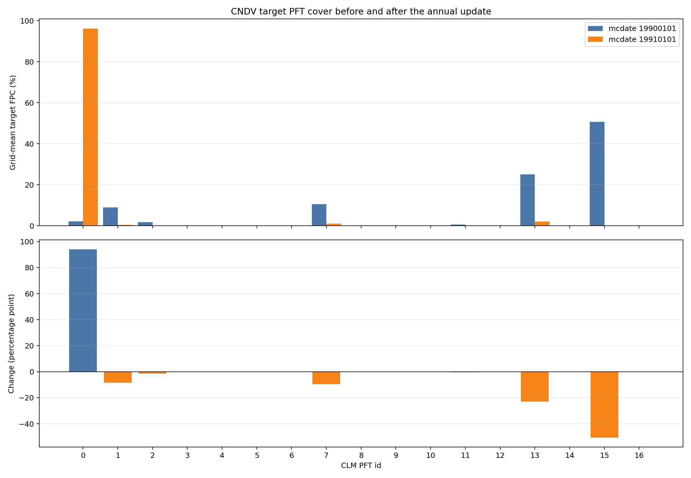

# RegCM 4.7-CNDV 1990—1991 首个完整年测试报告

## 技术摘要

本测试在 `huan` 集群上用本仓库的 RegCM 4.7-CNDV 二进制从
1990-01-01 00:00 连续积分至 1991-01-01 00:00。前处理作业 `39250713` 和
8 MPI 正式积分作业 `39250715` 均为 `COMPLETED 0:0`；2920 个三小时时次严格
连续，年末 CNDV 恰好调用一次且 `kyr=1`。年度 HV 与最终 CLM restart 的
FPC、NIND 及年度覆盖差逐槽完全一致，`drought_days` 在年末更新后全部归零。
因此，**首个完整年度的软件路径和保存/重启状态一致性通过工程验收**。

科学结果不能据此验收。第一次年度更新把自然 PFT1—14 的区域网格平均目标覆盖
从 **47.1621% 降至 3.87772%**，裸地 PFT0 从 **2.18273% 升至 96.1223%**，
初始占 **50.6552%** 的 PFT15 作物归零。它说明年度代码路径确实改变了 PFT，
但也暴露了冷启动碳库/覆盖状态和作物处理不适合作为平衡植被初值。此结果只能作为
软件回归证据，不能解释为可信的生态响应或论文复现。

## 第一次年度更新使目标覆盖大幅转向裸地

下图上部比较初始和第一年末的逐 PFT 目标覆盖，下部给出年度差。这里的
`FPCGRID` 是自然 soil landunit 内的年度目标覆盖百分比；实际耦合 PFT 权重将在
下一年度逐步内插，不应以年末瞬时 `pfts1d_wtxy` 代替。

区域统计以 1193 个有效 soil gridcell 为等权样本，PFT0—16 在每个格点上的目标
覆盖和均为 100%。主要自然类型变化如下。

| PFT | 类型 | 初始区域平均 FPC | 第一年度更新后 | 年度变化 |
| ---: | --- | ---: | ---: | ---: |
| 13 | 非北极 C3 草 | 25.0620% | 2.07083% | −22.9912 pp |
| 7 | 温带落叶阔叶树 | 10.5080% | 0.996653% | −9.51131 pp |
| 1 | 温带常绿针叶树 | 8.94496% | 0.439514% | −8.50544 pp |
| 2 | 寒带常绿针叶树 | 1.70746% | 0.186305% | −1.52116 pp |
| 11 | 寒带落叶阔叶灌木 | 0.604359% | 0.156787% | −0.447572 pp |
| 10 | 温带落叶阔叶灌木 | 0.252305% | 0.0196657% | −0.232639 pp |
| 8 | 寒带落叶阔叶树 | 0.0829841% | 0.00792161% | −0.0750625 pp |
| 5 | 温带常绿阔叶树 | 0 | 0.0000495% | +0.0000495 pp |

共有 2622 / 16702 个自然 PFT 槽位发生大于 `1e-8` 个百分点的变化，其中
1788 个达到报告阈值 `0.01` 个百分点；330 / 1193 个格点的主导自然 PFT 改变。
`0.01` 个百分点只是分析显示阈值，不是模式建立或消亡阈值。

## 测试范围、软件身份与配置

| 项目 | 值 |
| --- | --- |
| 独立代码仓库 | `weiguang1233/RegCM-4.7-cndv`，不是 RegCM5 分支 |
| 服务器源码 revision | `fbc6c6a2bd015a8565bc642ce768ba2416089095` |
| 主程序 | `regcmMPICN_CNDV_CLM45` |
| 主程序 SHA-256 | `ddd562a74732d43de28996138b30756dd2ed4a54614e680eb28e109f9436dacd` |
| 安装根目录 | `/public/home/elpt_2024_000795/packages/RegCM/RegCM-4.7-cndv` |
| 运行目录 | `/public/home/elpt_2024_000795/workdir_for_RCM/cndv_crossyear_regcm47_1990` |
| 区域 | 欧洲 Lambert conformal 小域 |
| 网格 | `iy=34`, `jx=64`, `kz=18`, `ds=60 km` |
| 大气 / SST | `EIN15` / `ERSST` |
| 时间 | 1990-01-01 00:00 至 1991-01-01 00:00，Gregorian |
| 步长 | 大气 `dt=150 s`；CLM `dtsrf=600 s` |
| 构建宏 | `CLM45 + CN + CNDV` |
| MPI | 1 节点、8 ranks，二维分解 `4 × 2` |

测试明确设置 `create_crop_landunit=.false.`；CLM history 采用月输出并只请求
`DROUGHT_DAYS` 和 `DROUGHT_DAYS20`。RegCM4.7 本次构建未启用 `--enable-nc4`，
HV、restart 和 history 为 NetCDF-3 64-bit-offset 文件；分析器因此使用
SciPy NetCDF 后端，而不是只能打开 HDF5/NetCDF4 的 h5py。

## 运行和输出完整性通过

| 验收项 | 实际结果 |
| --- | --- |
| 前处理 | job `39250713`，`COMPLETED 0:0`，7 分 40 秒 |
| 全年积分 | job `39250715`，`COMPLETED 0:0`，50 分 58 秒 |
| 模式内部耗时 | 3047.439363 秒 |
| 三小时时次 | 2920；首末为 1990-01-01 03:00 / 1991-01-01 00:00 |
| 时间缺口或重复 | 0 / 0 |
| 年度 CNDV 调用 | 1 次，`kyr=1` |
| 初始 HV 写出 | 1 次 |
| 月度 SAV / CLM restart / history-restart | 各 12 次 |
| `FATAL`、NaN、Inf、MPI abort、SIGSEGV | 均未发现 |
| 分析作业 | job `39257234`，`COMPLETED 0:0`，末行 `PFT_YEAR1_ANALYSIS_OK` |

输出目录含 62 个普通文件，共 547,299,604 字节。核心文件如下。

| 文件 | 字节 | SHA-256 |
| --- | ---: | --- |
| `c47yr1990.clm.regcm.hv.1991.nc` | 770,024 | `7ba8ac65ca5c2307029d55bfaddd152316928558cd83a5240adbf0a253f337ba` |
| `c47yr1990.clm.regcm.hv.1992.nc` | 770,024 | `ca3a358161adff03ea5624223bc351c6dedcc4e498db6c1ced7e0243b13ca4d6` |
| `c47yr1990_SAV.1991010100.nc` | 12,469,844 | `64b40ccbbdacd6992c288b11e3bb4fe3a901fffbec60dcc0d9cb7035859bb259` |
| `c47yr1990.clm.regcm.r.1991010100.nc` | 32,660,140 | `253f025fcb442c47f6c02a322a5bc551f0a58cd5a70e027c00975c0b94f6eee5` |
| `c47yr1990.clm.regcm.rh0.1991010100.nc` | 174,944 | `32d8f4d736c04b3bb613a9f983f35904f7540ceb34bf23cb39a7b8ab88a76cc0` |

HV 文件名采用当前代码的“内部年份 + 1”规则：文件内 `mcdate=19900101` 的初始
状态写为 `hv.1991.nc`，`mcdate=19910101` 的第一年度更新后状态写为
`hv.1992.nc`。分析以 `mcdate` 和完整映射数组为准，不按文件名猜测年份。

## 保存状态和干旱状态一致

对 PFT 状态的强制 QA 结果如下。

| QA 项 | 结果 |
| --- | ---: |
| 三个 PFT 映射数组 | 初末完全一致 |
| 初始逐格 PFT0—16 闭合最大误差 | `2.8422e-14` pp |
| 年末逐格 PFT0—16 闭合最大误差 | `2.8422e-14` pp |
| 年末 `100*fpcgrid` vs HV `FPCGRID` 最大差 | 0 pp |
| 年末 restart `nind` vs HV `NIND` 最大差 | 0 |
| `100*(fpcgrid-fpcgridold)` vs 两份 HV 年度差最大误差 | 0 pp |
| 有效 active-soil column | 1193 |
| 年末 `drought_days` | 全部严格为 0 天 |

首年末 `drought_days20` 的最小值、均值、中位数、P95 和最大值分别为
5.21528、161.147、152.806、301.190 和 359.792 天；1153 / 1193 个 column
大于 45 天。1991-01-01 history 在 `dv()` 前保存的 1990 年当年干旱日数与
restart 在 `dv()` 后保存的首年 `drought_days20` 最大差为 `1.36e-5` 天，差值
来自 history 的 float32 精度。

## 本测试能证明什么、不能证明什么

本测试证明：RegCM4.7 的 CLM4.5-CN-CNDV 构建可完成一整个日历年；年末 `dv()`
实际执行；PFT 目标发生非零变化；HV 与 restart 的年度状态一致；新增干旱状态可写、
可读、可在年末更新和清零。

本测试不能证明科学结果正确，原因包括：

1. 只有一个冷启动年份，没有 C/N 库和植被结构 spin-up；
2. 当前 CNDV 不模拟 crop PFT，欧洲 surface 中 PFT15 初值在首年被清除；
3. 本域 PFT4 热带常绿阔叶树在初末均为零，无法验证 ModifiedDV 的 45 天规则；
4. 没有与关闭 CNDV 的原始 CLM4.5-CN、旧实现或观测资料做严格 A/B 对照；
5. `drought_days20` 是 19/20 一阶递推平均，不是保存最近 20 个年度样本的有限窗口。

因此两级结论是：**工程验收通过；科学可信度验收不通过**。第二个完整年份的
restart 连续性和 PFT 变化见
[1990—1992 两整年报告](CNDV_TWO_YEAR_TEST_REGCM47_ZH.md)。

## 可复现资产

本次 namelist、Slurm 作业和分析程序保存在
[`Testing/CNDV/regcm47_1990_1992`](../Testing/CNDV/regcm47_1990_1992/)。逐类型
精确结果和 QA 摘要位于
[`Doc/cndv-test-assets`](cndv-test-assets/)。原始 NetCDF、模式日志和输入资料因
体量和服务器路径依赖不纳入 Git；其文件身份以本报告 SHA-256 表为准。

报告日期：2026-09-07。
