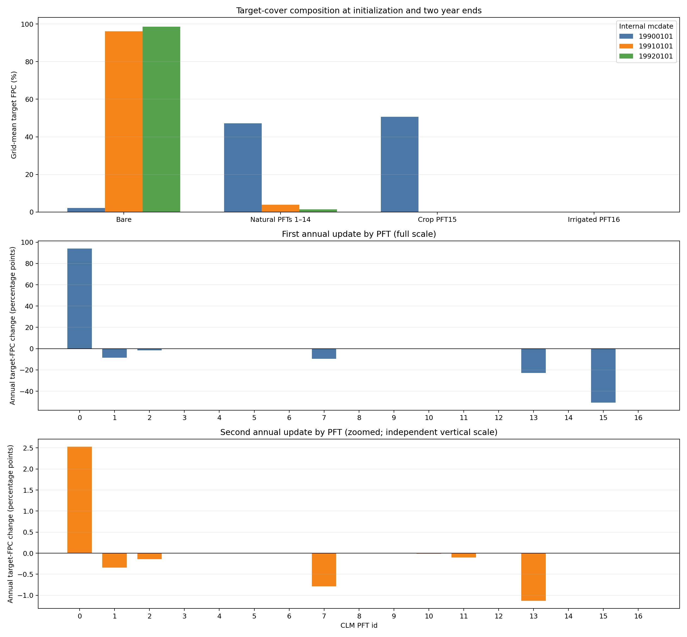
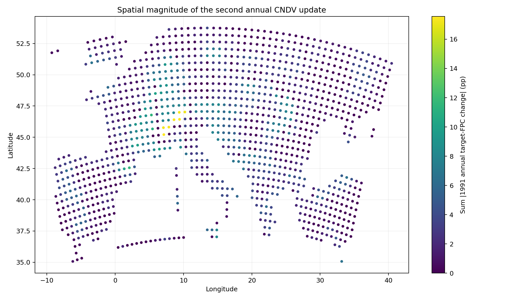

# RegCM 4.7-CNDV 1990—1992 两整年连续测试报告

## 技术摘要

第二个完整年份已经从经过校验的 1991-01-01 restart 连续运行至
1992-01-01。32 MPI 正式作业 `39257200` 为 `COMPLETED 0:0`，2920 个三小时
输出时次严格连续；年末 CNDV 恰好调用一次且 `kyr=2`。第二年末 HV、CLM
restart、年度 PFT 增量和 `present` 状态通过交叉核验，干旱长期量也满足当前代码的
19/20 递推公式。因此，**两整年连续运行和 restart 状态链通过工程验收**。

第二年并未使植被恢复到合理状态。自然 PFT1—14 的区域网格平均目标覆盖从第一年末
的 **3.87772% 继续降至 1.35255%**，裸地从 **96.1223% 升至 98.6474%**。
第二年自然 PFT 槽位的绝对变化总量是首年的 5.86%，说明年度冲击幅度已缩小，但
系统仍沿异常的近裸地冷启动轨迹变化。结论仍是：**工程路径通过，科学可信度不通过**。

本欧洲域的 PFT4 热带常绿阔叶树在初始、第一年末和第二年末均为零，所以本测试
不能验证 ModifiedDV 专门针对 PFT4 的 45 天干旱生存/建立限制。

## 两次年度更新均使自然目标覆盖下降

下图上部给出初始、第一年末和第二年末的目标覆盖组成；中、下两个面板分别展示
第一次和第二次年度更新，并使用独立纵轴。独立尺度是必要的：第二年全部自然 PFT
槽位的绝对变化总量只有首年的 5.86%，共用首年尺度会掩盖第二年结构变化。



下表是 1193 个有效 soil gridcell 的等权平均。`FPCGRID` 单位为百分比，PFT0—16
在每个 soil gridcell 上合计 100%。

| 组成 | 1990-01-01 初始 | 1991-01-01 第一年度更新后 | 1992-01-01 第二年度更新后 | 第二年变化 |
| --- | ---: | ---: | ---: | ---: |
| 裸地 PFT0 | 2.18273% | 96.1223% | 98.6474% | +2.52517 pp |
| 自然 PFT1—14 | 47.1621% | 3.87772% | 1.35255% | −2.52517 pp |
| 作物 PFT15 | 50.6552% | 0 | 0 | 0 |
| 灌溉作物 PFT16 | 0 | 0 | 0 | 0 |
| 树 PFT1—8 | 21.2434% | 1.63044% | 0.353979% | −1.27646 pp |
| 灌木 PFT9—11 | 0.856664% | 0.176453% | 0.0571226% | −0.119330 pp |
| 草 PFT12—14 | 25.0620% | 2.07083% | 0.941450% | −1.12938 pp |

第二年自然覆盖的净下降量是首年净下降量的 5.83%。树、灌木和草三个功能组均继续
下降，并非一种功能组的恢复抵消其他类型损失；第二年末 1.35255% 的残余自然覆盖
中，草占约 69.6%。

## 第二年变化以 PFT13、PFT7 和 PFT1 的继续减少为主

| PFT | 第二年区域平均变化 | 第二年末区域平均 FPC |
| --- | ---: | ---: |
| PFT13 非北极 C3 草 | −1.12938 pp | 0.941450% |
| PFT7 温带落叶阔叶树 | −0.786536 pp | 0.210117% |
| PFT1 温带常绿针叶树 | −0.343739 pp | 0.0957746% |
| PFT2 寒带常绿针叶树 | −0.139888 pp | 0.0464171% |
| PFT11 寒带落叶阔叶灌木 | −0.104373 pp | 0.0524140% |
| PFT10 温带落叶阔叶灌木 | −0.0149571 pp | 0.00470861% |
| PFT8 寒带落叶阔叶树 | −0.00630328 pp | 0.00161832% |
| PFT5 温带常绿阔叶树 | +0.00000202 pp | 0.0000516% |

第二年有 2125 / 16702 个自然 PFT 槽位发生大于 `1e-8` pp 的变化，1718 个达到
报告阈值 `0.01` pp。用年初和年末 restart 的精确 `present` 标志统计，84 个槽位
建立、13 个消亡，存在槽位由 2559 增至 2630；覆盖仍净下降说明新建立多为很小的
seed 状态，`present` 数目增加不能解释为总覆盖恢复。

在两年都达到 0.01 pp 变化阈值的 1717 个槽位中，1274 个（74.20%）延续同一
方向，443 个（25.80%）反向。主导自然 PFT 在 88 / 1193 个格点发生转换；由于
第二年末自然覆盖仅 1.35%，这些“主导”类型常只是极小残余中的最大值。

第二年每格自然 PFT 绝对变化量之和的平均值为 2.53949 pp，中位数 1.78214 pp，
P95 为 7.75300 pp。766 个格点超过 1 pp，199 个超过 5 pp，14 个超过 10 pp，
没有格点超过 20 pp。最大格点是 gridcell 495（45.2126°N，7.12823°E），总绝对
变化 17.5678 pp，其中 PFT11 从 25.8852% 降至 8.37204%，贡献 −17.5132 pp。

下图使用线性色标展示这一空间幅度；它用于识别变化集中区，不用于表示变化方向。



## 时间、状态和比较基线

| 项目 | 配置 |
| --- | --- |
| 独立仓库 | `weiguang1233/RegCM-4.7-cndv` |
| 服务器二进制源码 revision | `fbc6c6a2bd015a8565bc642ce768ba2416089095` |
| 二进制 SHA-256 | `ddd562a74732d43de28996138b30756dd2ed4a54614e680eb28e109f9436dacd` |
| 区域 | 欧洲 Lambert conformal 小域，`iy=34`, `jx=64`, `kz=18`, `ds=60 km` |
| 有效 soil gridcell | 1193 |
| 大气 / SST | `EIN15` / `ERSST` |
| 首年 | 1990-01-01 至 1991-01-01，冷启动，8 MPI |
| 第二年 | 1991-01-01 至 1992-01-01，restart，32 MPI |
| 步长 | 大气 `dt=150 s`；CLM `dtsrf=600 s` |
| CNDV 构建 | `CLM45 + CN + CNDV` |
| 输出容器 | NetCDF-3 64-bit-offset |

本文的三个年度目标状态如下。文件名年份偏大一是现有 `histCNDV` 命名行为，分析器
依据文件内 `mcdate` 和完整 PFT 映射，不依据文件名直觉。

| 内部日期 `mcdate` | 年度 HV | 含义 |
| --- | --- | --- |
| 19900101 | `hv.1991.nc` | 冷启动初始目标 |
| 19910101 | `hv.1992.nc` | 1990 年年度更新后目标 |
| 19920101 | `hv.1993.nc` | 1991 年年度更新后目标 |

`FPCGRID` 是下一年度目标覆盖。实际用于通量耦合的 PFT 权重会在随后一年中由旧目标
内插到新目标，不能用年末瞬时 `pfts1d_wtxy` 代替年度目标差。

## Restart 连续性和运行日志通过验收

第二年保持 `mdate0=1990010100`，设 `mdate1=1991010100`、
`mdate2=1992010100`。年初成套复制并逐字节核对：

- `c47yr1990_SAV.1991010100.nc`；
- `c47yr1990.clm.regcm.r.1991010100.nc`；
- `c47yr1990.clm.regcm.rh0.1991010100.nc`。

日志明确进入 continuation、成功读取 RegCM 和 CLM restart，且没有再次出现
`Writing initial CNDV FPCGRID`。CLM 输出的“namelist 未自动核对”是旧版通用
restart 提示；本测试保持物理和 history 配置一致，并用完整状态和输出交叉检查补足。

| 作业 | 作用 | 状态 | 耗时 |
| --- | --- | --- | ---: |
| `39257198` | 1991 SST/ICBC 前处理 | `COMPLETED 0:0` | 5 分 37 秒 |
| `39257199` | SAV/r/rh0 暂存和 SHA 核验 | `COMPLETED 0:0` | 1 秒 |
| `39257200` | 1991 全年、32 MPI | `COMPLETED 0:0` | 26 分 17 秒 |
| `39257201` | PFT 与 restart 分析 | `COMPLETED 0:0` | 7 秒 |
| `39257404` | 干旱 19/20 递推独立复算 | `COMPLETED 0:0` | 3 秒 |

| 日志/数据 QA | 结果 |
| --- | --- |
| MPI 分解 | 1 节点、32 ranks，`8 × 4` |
| 模式内部耗时 | 1547.944914 秒 |
| 三小时时次 | 2920；1991-01-01 03:00 至 1992-01-01 00:00 |
| 时间缺口 / 重复 | 0 / 0 |
| 年度 CNDV 调用 | 恰好 1 次，`kyr=2` |
| 月度 SAV / CLM restart / history-restart | 各 12 次 |
| `FATAL`、NaN、Inf、MPI abort、SIGSEGV | 0 |
| 三份 HV 映射和坐标 | 一致 |
| PFT0—16 逐格闭合最大误差 | `2.8422e-14` pp |
| 第二年末 HV vs restart FPC/NIND 最大差 | 0 / 0 |
| restart 年度 FPC 差 vs 两份 HV 差最大误差 | 0 pp |
| 年初 restart vs 第一年度 HV FPC/NIND 最大差 | 0 / 0 |
| 年末 active-soil `drought_days` | 1193 个 column 全为 0 |

首年 8 MPI 模式内部耗时 3047.439363 秒，第二年 32 MPI 为 1547.944914 秒，
观测比值约 1.97。两个年份的物理负载不同，所以这不是严格并行 scaling 试验；它只
说明对这个小域从 8 增至 32 ranks 有有限加速。使用 2 节点 × 64 ranks 会使子域
过小且通信/I/O 占比更高，本次没有盲目采用 128 ranks。

## 干旱状态连续且符合当前 19/20 递推

1992-01-01 的月 history 在 `dv()` 前保存 1991 年累计干旱日数，最终 restart 在
`dv()` 后写入长期量并把当年累计清零。1193 个 active-soil column 与 1193 个
history gridcell 通过经纬度一一匹配。

| 指标 | 第一年度更新后 d20 | 1991 当年累计（pre-DV） | 第二年度更新后 d20 |
| --- | ---: | ---: | ---: |
| 最小值 | 5.21528 天 | 0 天 | 6.36944 天 |
| 均值 | 161.147 天 | 151.966 天 | 160.688 天 |
| 中位数 | 152.806 天 | — | 152.256 天 |
| P95 | 301.190 天 | — | 301.811 天 |
| 最大值 | 359.792 天 | 360.333 天 | 359.549 天 |
| d20 超过 45 天的 column | 1153 | 不适用 | 1153 |

逐 column 复算：

```text
第二年度 drought_days20 =
    (19 × 第一年度 drought_days20 + 1991 drought_days) / 20
```

递推结果与第二年 restart 的最大绝对差为 `6.78e-7` 天，RMS 差为
`2.28e-7` 天；history 所携带的旧 d20 与第一年 restart 最大差为 `1.36e-5` 天，
均低于 float32 history 对应的 `5e-5` 天容差。最终 `drought_days` 最大绝对值为
0。三个独立 gate 均为 true。

这里的 `drought_days20` 是一阶递推平滑，不是保留最近 20 个年度样本的严格滑动
窗口；且第一个完整年结束后就开始应用。报告不把它描述成已积满 20 年的气候态。

## 核心输出身份

第二年输出目录共有 64 个普通文件，591,834,360 字节；其中包含从首年复制的三件
restart 文件。第二年末核心文件如下。

| 文件 | 字节 | SHA-256 |
| --- | ---: | --- |
| `c47yr1990.clm.regcm.hv.1993.nc` | 770,020 | `c729c9cc45b1bc253ef1b18810d2526094c0751ed02bdb39fc33541684b698f1` |
| `c47yr1990_SAV.1992010100.nc` | 12,469,844 | `41f657dbab1341b855802699c7b89cacdef78617f41825e71785ce18a5b478ae` |
| `c47yr1990.clm.regcm.r.1992010100.nc` | 32,660,136 | `e4a3e46503a9f283ef5af90aada8aef04f19b6f93ff8af638bd1b90556cdf5fd` |
| `c47yr1990.clm.regcm.rh0.1992010100.nc` | 174,940 | `77cbb29023a6de8db0a253bc8fa6af090a78b5e08b814e9f7f88a259bcdba590` |
| `c47yr1990.clm.regcm.h0.199201.nc` | 87,360 | `45dc28ad017ee2a107f9ec9572fb848a6324fca30b038777d912b9691c22f143` |

服务器和本地分别用同一组分析器从原始 NetCDF 重新计算；逐类型、top-change、
转换矩阵、三状态和逐 column 干旱 CSV 均逐字节一致。由此排除了只复制服务器摘要
而未复算的风险。

## 为什么不能直接与 RegCM5 数值作版本归因

RegCM4.7 和 RegCM5 的测试使用相同名义 namelist 参数和资料类型，但两个版本生成
的 DOMAIN 并非逐格相同：对应数组的纬度最大差约 0.3566°、经度最大差约
0.5792°，land mask 有 269 个格点不同；最终有效 soil gridcell 也是 1193 对
1311。因此，两个版本的区域均值包含网格和掩膜差异，不能直接相减并归因于 CNDV
代码版本。

可比较的结论是：两个版本都能各自在完整年度和 restart 年完成 CNDV 年末更新，
且各自内部 HV/restart/干旱状态一致。若要量化 4.7 与 5 的模式差，必须先使用同一
DOMAIN、相同静态 surface、相同有效像元和一致权重，再做配对 A/B 试验。

## 科学解释边界和下一步

本测试不能作为论文级科学验证，主要原因是：

1. 冷启动后自然覆盖两年内从 47.16% 降至 1.35%，明显没有达到平衡；
2. 当前 CNDV 不模拟 crop PFT，初始 50.66% 的 PFT15 在首年归零；
3. PFT4 在三个年度状态中均为零，无法检验 45 天规则的目标对象；
4. 没有关闭 CNDV 的 CLM4.5-CN、旧 CNDV 实现或观测对照；
5. 两年不足以验证 C/N 库、植被结构和递推气候状态收敛。

推荐顺序：

1. 构建自然植被专用 surface 或明确 crop-to-natural 映射；
2. 用循环 forcing 做 CNDV/CN spin-up，同时监控 FPC、NIND、LAI、GPP/NPP、
   植被碳、土壤 C/N、水量和能量守恒，以收敛标准决定停止；
3. 建立初始含非零 PFT4 的热带小域，在 45 天阈值两侧做多年和 restart 试验；
4. 在同一网格/静态输入上对原始 CLM4.5-CN、旧参考实现和新 CNDV 做 A/B；
5. 若研究设计需要严格“最近 20 年平均”，应另行实现年度环形缓冲并验证，而不是
   将当前 19/20 递推误称为有限滑动窗口。

不建议把当前近裸地轨迹机械追加很多年后直接用于科学结论；应先解决初始化、作物和
同网格对照问题。

## 可复现资产和服务器位置

配置、Slurm 脚本、两种 PFT 分析器和干旱递推验证器位于
[`Testing/CNDV/regcm47_1990_1992`](../Testing/CNDV/regcm47_1990_1992/)。精确
逐 PFT 数值、成对 QA 和递推 QA 位于
[`Doc/cndv-test-assets`](cndv-test-assets/)。

服务器目录：

```text
/public/home/elpt_2024_000795/workdir_for_RCM/cndv_crossyear_regcm47_1990
/public/home/elpt_2024_000795/workdir_for_RCM/cndv_year2_regcm47_1991
```

原始输入、NetCDF 输出和大日志不纳入 Git；报告保存文件名、大小、SHA-256、作业号
和可复算脚本。报告日期：2026-09-07。
